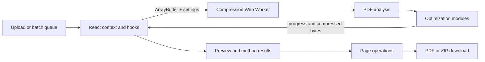

# PDF Compress

A privacy-first PDF compressor that runs its processing pipeline in the browser so document bytes do not need to be uploaded to a compression server.

## Overview

PDF compression usually forces a choice between opaque presets and uploading a document to a third party. I built PDF Compress to make that tradeoff visible: users can choose a preset or tune individual techniques, see their effect, edit pages, and download the result from one browser workflow.

The application is a Next.js frontend backed by a dedicated Web Worker. Its TypeScript processing pipeline inspects PDF structure, applies selected image, font, stream, vector, and metadata optimizations, and returns the compressed bytes to the UI. Optional analytics and error reporting send event or diagnostic metadata; the PDF processing path itself is client-side.

## Features

- Single-file and multi-file PDF compression
- Minimal, Balanced, Aggressive, and custom compression settings
- Target-size control with progressively stronger fallback strategies
- Risk-grouped optimization methods with document-specific applicability checks
- Before/after size reporting, visual comparison, and per-method savings estimates
- Page reordering, rotation, deletion, and per-page original preservation
- Batch result downloads, including ZIP packaging

## Technical Highlights

- **Responsive processing:** compression runs in a Web Worker, with transferable `ArrayBuffer` results, progress messages, job IDs that suppress stale responses, cancellation, and timeout handling.
- **Adaptive target sizing:** the worker first uses an incremental, budget-aware image pipeline and then escalates through bounded compression tiers when a requested target is not met. It retains the smallest valid result rather than assuming a harsher pass is always better.
- **Composable PDF optimization:** processing is separated into image, font/resource, content-stream, structure, vector, rasterization, and page-operation modules. Methods range from lossless cleanup to explicitly labeled destructive transformations.
- **Fast feedback:** the main result is returned before independent method-savings measurements finish; later worker messages update the UI without delaying the download path.
- **Defensive failure handling:** file type and PDF signatures are validated, encrypted and corrupted documents receive typed errors, worker failures are isolated, and a broken batch worker is recreated for the next file.
- **Privacy boundary:** PDF bytes stay in the browser processing flow. Analytics, feedback, and error-reporting integrations are separate and transmit metadata to configured third-party endpoints.
- **Verification:** Vitest covers presets, target-size escalation, compression-potential calculations, utilities, polyfills, method categorization, and compression consistency. Type checking and ESLint are exposed as dedicated scripts.

## Architecture



`PdfContext` coordinates the selected file, settings, worker state, and analysis for the single-file flow. `useBatchCompression` queues files and processes them sequentially through a reusable worker to bound concurrent memory use. Inside the worker, `pdf-processor` orchestrates the specialized modules and posts progress and results back to React. PDF.js renders previews, while pdf-lib reads, rewrites, and saves documents; page edits are applied when the final download is assembled.

## Tech Stack

- Next.js 16 and React 19
- TypeScript 5.9
- Tailwind CSS 4 and Framer Motion
- pdf-lib and PDF.js (`pdfjs-dist`)
- pako for stream compression
- Web Workers and browser Canvas APIs
- Vitest, Testing Library, ESLint, and TypeScript
- Vercel and Netlify configuration
- Optional Google Analytics, Plausible, and Google Apps Script telemetry/feedback integrations

## Getting Started

Requirements: Node.js 20 is the version declared by the Netlify build configuration, and npm is supported by the committed lockfile.

```bash
npm install
npm run dev
```

Open [http://localhost:3000](http://localhost:3000).

Core compression requires no API keys. To customize the canonical site URL or optional analytics integrations, copy `.env.example` to `.env.local` and set only the variables you need.

Useful verification commands:

```bash
npm run typecheck
npm run lint
npm test
npm run build
```

## Demo

Live application: [freecompresspdf.com](https://www.freecompresspdf.com/)

## Project Status

**Active.** The browser compression workflow, batch mode, page tools, previews, telemetry hooks, and automated tests are implemented. Future ideas are tracked separately in the roadmap documents and are not presented here as current functionality.

## What I Learned

- Moving CPU-heavy PDF work off the React thread is only part of worker design; transferable buffers, stale-job protection, failure recovery, and staged result delivery materially affect the user experience.
- PDF compression is a constrained optimization problem. A requested byte target may be impossible without destructive changes, so the UI and pipeline need risk levels, bounded escalation, and an honest best-result fallback.
- Low-level PDF cleanup is format-sensitive. Font subsetting, object reachability, content-stream rewriting, and resource deduplication need conservative checks because a smaller file is not useful if rendering or text extraction breaks.
- A privacy-first architecture still needs precise disclosure: local document processing and external diagnostic metadata are separate data paths and should be described separately.
